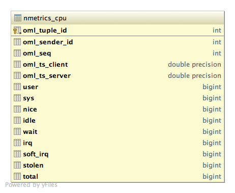
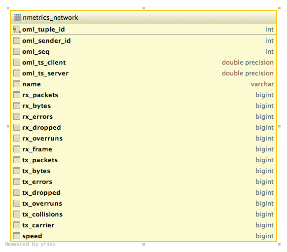

Network Topology Monitor
========================

This example visualises node and network load for a particular topology.

It is driven by
static and a  dynamic data sources. The static one is currently assumed to be maintained
manually, while the dynamic one is driven by OML's 'nmetrics' app. The nmetric app is
providing information from a node on CPU, memory, and network usage. Let's have a look
at the CPU schema:

The node itself is identified by "oml_sender_id" which is a foreign key into the "_senders"
table which in turn holds the value provided to the '--oml-id" flag on the node.

As for capturing links, we assume that we only have node-to-node links with their respective
interfaces on the nodes. The schema for the network measurements are as follows:

To complete the topology description we need an additional table which ties two nodes
to a single link. We could automate this with other tools, or some additional "domain knowledge"
such as that each link has its own subnet (assuming we would also record the IP address of
a node), but we don't. The "nmetrics_network" table contains a reference (oml_sender_id) to the
node and a "name" field containing the name of the interface the measurements were collected
from.

So we need a "links" table with the following schema

    CREATE TABLE links (
      id SERIAL PRIMARY KEY NOT NULL,
      from_id INTEGER NOT NULL,
      from_if_name CHARACTER VARYING(16) NOT NULL,
      to_id INTEGER NOT NULL,
      to_if_name CHARACTER VARYING(16) NOT NULL,
      status CHARACTER VARYING(16) NOT NULL
    );

We also need the geographic location of all the sites hosting nodes in a "sites" table and then
a listing of all the nodes themselves with the following schemas

    CREATE TABLE sites (
      id SERIAL PRIMARY KEY NOT NULL,
      name TEXT NOT NULL,
      lat DOUBLE PRECISION NOT NULL,
      lon DOUBLE PRECISION NOT NULL
    );

    CREATE TABLE nodes (
      id SERIAL PRIMARY KEY NOT NULL,
      site_id INTEGER NOT NULL,
      name TEXT NOT NULL,
      status CHARACTER VARYING(16) NOT NULL,
      zoom_level INTEGER NOT NULL DEFAULT 0
    );

A simple query for the CPU usage of nodes with quite a few redundant columns would look like:

    SELECT nmetrics_cpu.*, nodes.*, sites.*
    FROM nmetrics_cpu, _senders, nodes, sites
    WHERE nmetrics_cpu.oml_sender_id = _senders.id
          AND _senders.name = nodes.name
          AND nodes.site_id = sites.id
    ORDER BY nmetrics_cpu.oml_tuple_id DESC
    LIMIT 20;

